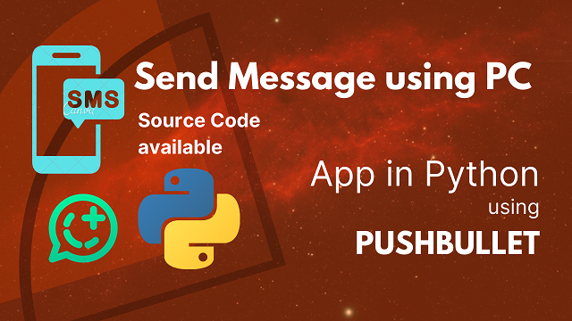

# Python: GUI App for PushBullet API
Python GUI (Desktop) App using Tkinter and PySimpleGUI integrating with PushBullet to send messages
  
## Requirements:
- Create a script 
- Link the pushbullet site API 
- It should send messages automatically 
- Connecting to the Pushbullet API: The script will connect to the Pushbullet API using the API key and access token. 
- Choosing the device: The user will be prompted to choose the device connected to their email that they want to send the messages from. 
- Message content: The user will be prompted to choose a file containing the message they want to send. The script will read the contents of the file and store it in a variable. 
- Transmission time: The user will be prompted to set the time interval between each transmission. The script will use this interval to determine when to send each message. 
- Automatic transmission: The script will use a loop to continuously send the messages at the specified interval until the user stops the process.  

## Demo:

  

  

contact: urdujini@gmail.com
